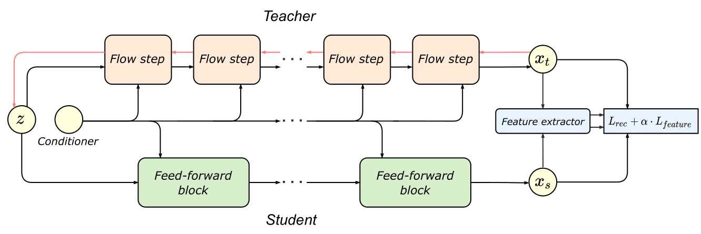

# Distilling the Knowledge from Normalizing Flows

Official implementation of the paper [Distilling the Knowledge from Normalizing Flows](TODO) (ICMLW'2021) by Dmitry Baranchuk, Vladimir Aliev, Artem Babenko.

## Overview

The approach transfers the knowledge from Normalizing Flows (NF) to efficient feed-forward models to speed up inference and reduce the model size. The effectiveness of this approach is demonstrated on two state-of-the-art conditional flow-based models for image super-resolution ([SRFlow](https://github.com/andreas128/SRFlow)) and speech synthesis ([WaveGlow](https://github.com/NVIDIA/waveglow)).

* [SRFlow distillation](https://github.com/yandex-research/distill-nf/tree/master/srflow) 
* [WaveGlow distillation](https://github.com/yandex-research/distill-nf/tree/master/waveglow)



## Citation

```
@inproceedings{baranchuk2021distilling,
    title={Distilling the Knowledge from Normalizing Flows},
    author={Dmitry Baranchuk and Vladimir Aliev and Artem Babenko},
    booktitle={ICML Workshop on Invertible Neural Networks, Normalizing Flows, and Explicit Likelihood Models},
    year={2021},
    url={https://openreview.net/forum?id=fEPhiuZS9TV}
}
```
